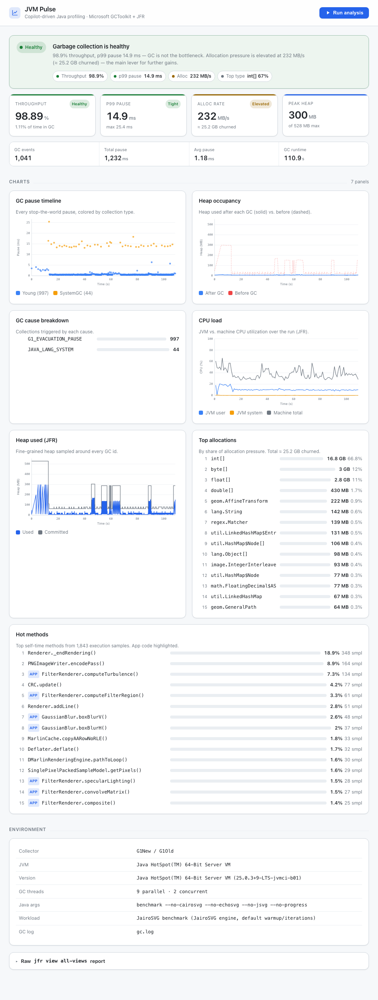
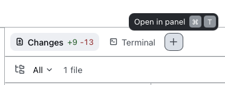
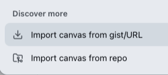
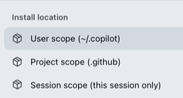

# JVM Pulse

**Profile any Java project's garbage collection and flight-recorder telemetry —
right inside GitHub Copilot.**

JVM Pulse is a [GitHub Copilot CLI](https://github.com/github/copilot-cli)
**canvas extension**. It runs a representative workload for your Java project
with GC logging + JFR enabled, analyzes the results with Microsoft
[GCToolkit](https://github.com/microsoft/gctoolkit) and the JDK `jfr` CLI, and
visualizes everything — throughput, pauses, heap, allocations, hot methods — in
an interactive side panel. One click then asks Copilot to read the numbers and
recommend JVM tuning and code optimizations.

It is **Copilot-driven**: the extension doesn't hard-code how to build or run
your project. The **Run analysis** button asks Copilot to detect your build tool
and JDK, launch a workload with the right flags, and hand the artifacts back for
analysis. It works with Maven, Gradle, JMH, runnable jars, jbang scripts — any
Java workload Copilot can start.



## Requirements

The extension runs on your machine and shells out to:

- **A JDK** with the `jfr` CLI on `PATH` (JDK 11+ for JFR; JDK 9+ for unified GC
  logging). JDK 8 is supported for GC logs.

That's the only hard requirement. The extension uses
**[jbang](https://www.jbang.dev/)** to run the bundled GCToolkit analyzer:

- If a native `jbang` is already installed (via `sdk install jbang`,
  `brew install jbang`, `curl -Ls https://sh.jbang.dev | bash`, …) it is used
  as-is.
- Otherwise, on first run the extension **lazily downloads a pinned jbang
  release into `~/.jvm-pulse` and drives it through your JDK** — no separate
  jbang install, and no `curl`/`unzip` needed (extraction uses the JDK's own
  `jar`). GCToolkit itself is then fetched once via the analyzer's inline
  `//DEPS`.

Tool paths are auto-resolved from `PATH`, `JAVA_HOME`, and common install
locations; inspect them with the `tool_status` canvas action.

## Install

JVM Pulse is a folder-based Copilot CLI extension. Drop it into an extensions
directory and reload.

### Into a single project (recommended)

From the root of your Java project:

```bash
git clone https://github.com/brunoborges/jvm-pulse.git .github/extensions/jvm-pulse
```

The extension loads automatically for Copilot CLI sessions in that repo. (You can
also add it as a git submodule, or just copy the files in.)

### For all your projects (user-level)

Clone it into your personal Copilot CLI extensions directory:

```bash
git clone https://github.com/brunoborges/jvm-pulse.git \
  "$HOME/Library/Application Support/com.github.githubapp/extensions/jvm-pulse"   # macOS
# Linux: ~/.config/github-copilot/extensions/jvm-pulse (or your platform's config dir)
```

### From the Copilot app

If you use the GitHub Copilot app, you can install JVM Pulse straight from the UI:

1. In a session, open the right-side panel and click the **+** (add canvas
   extension) button, next to **Terminal**.

   

2. Choose **Import canvas from repo** (under *Discover more*).

   

3. Paste this repository's URL: `https://github.com/brunoborges/jvm-pulse`
4. Pick an **install location**. We recommend **User scope (`~/.copilot`)** so the
   extension is available across all your projects. (Project scope drops it into
   `.github/`, and Session scope installs it for the current session only.)

   

> **Keeping up to date:** this flow installs a *copy* of the `main` branch, so it
> won't pick up new releases automatically. To stay current, instead `git clone`
> the repo into your extensions directory and `git pull` when you want updates:
>
> ```bash
> git clone https://github.com/brunoborges/jvm-pulse.git \
>   ~/.copilot/extensions/jvm-pulse
> # later: cd ~/.copilot/extensions/jvm-pulse && git pull
> ```

After installing, start (or reload) a Copilot CLI session — **JVM Pulse** appears
as an available canvas.

## Usage

Open the **JVM Pulse** canvas and click **Run analysis** (optionally telling
Copilot what workload to run), or drive it from chat.

```
[Run analysis] ──▶ Copilot builds + runs your workload with GC log + JFR
                                     │
                                     ▼
                   Copilot calls the jvm_pulse_ingest tool
                   with the gc.log / dump.jfr paths
                                     │
                                     ▼
       GCToolkit + jfr CLI analysis ──▶ canvas visualization
                                     │
                   [Analyze with AI] ──▶ Copilot reads the report
                                         and recommends tuning
```

Already have artifacts? Ask Copilot to call **`jvm_pulse_ingest`** with an
existing `gc.log` and `.jfr` on disk — no run required.

### Actions & tools

- **`jvm_pulse_ingest`** *(agent tool)* — `{ gcLogPath, jfrPath?, label?, command? }`.
  Analyzes a GC log + optional JFR recording and updates the canvas. Copilot
  calls this after running a workload, or you can point it at existing artifacts.
  Pass `command` with the exact launch command (including JVM flags) so the run's
  tuning is recorded and comparable.
- `run_analysis` *(canvas action)* — `{ hint?, jfrMaxSizeMb? }`. Injects the
  "build + run this project's workload with GC logging + JFR" request into the
  session; Copilot does the project-specific work.
- `analyze_with_copilot` *(canvas action)* — sends the latest report (with the
  full `report.json` + `jfr view` output attached) to Copilot for tuning advice.
- `load_results` — return the latest saved analysis without re-running.
- `tool_status` — resolved `jbang` / `jfr` paths.

## What it shows

- **Run history** — every ingested run is kept; pick any past run from the **Run**
  selector in the toolbar to view it again.
- **Compare** — toggle **Compare** and choose a baseline to see a metric-by-metric
  diff (throughput, pauses, allocation, heap, GC events) with colored deltas, plus
  a flag-level diff of the two runs' launch commands.
- **Command** — each run records the exact command and JVM flags used to launch
  the workload, shown in the report and diffed in Compare, so JVM tuning between
  runs is visible.
- **Verdict** — a plain-language GC health assessment with semantic status.
- **KPIs** — throughput %, p99 pause, allocation rate, peak heap, plus GC count,
  total/avg pause and runtime.
- **GC pause timeline** — every stop-the-world pause, colored by collection type.
- **Heap occupancy** — heap before/after each GC (GC log) and used/committed
  sampled by JFR.
- **GC cause breakdown** — collections per cause.
- **CPU load** — JVM user/system and machine-total utilization over the run.
- **Top allocations** — allocated volume by type (JFR object sampling).
- **Hot methods** — top self-time methods (JFR execution sampling), with your
  application code called out from JDK internals.
- **Lock contention** — threads blocked entering monitors, aggregated by lock
  class (JFR `jdk.JavaMonitorEnter`), so a hot lock stops hiding behind GC.
- **Safepoints** — time-to-safepoint synchronization latency (count, total, max,
  avg) that stop-the-world pauses attribute to neither GC nor your code.
- **Exceptions & errors** — throwables created during the run and the top throw
  sites, to catch exception storms.
- **Threads** — live thread population over the run (active vs. peak).
- **Slow I/O** — blocking socket/file operations over the JFR threshold, by
  endpoint/path, with bytes and count.
- **Environment** — JVM, collector, threads, workload label, GC log source.
- **`jfr view all-views`** — the raw JFR views report, inline.

## How the data is produced

1. **GC logging** — the workload JVM is launched with GC logging. Copilot picks
   the form that matches the detected JDK (unified `-Xlog:gc*:file=…` on JDK 9+,
   `-Xloggc` + `-XX:+PrintGCDetails` on JDK 8).
2. **Microsoft GCToolkit** — parses the GC log into per-collection events (pause,
   cause, heap before/after) and derives throughput, pause percentiles and
   allocation rate.
3. **JFR** — the JVM records a flight recording
   (`-XX:StartFlightRecording=maxsize=…M,filename=dump.jfr,settings=profile`).
   The `jfr` CLI extracts CPU load, heap samples, top allocations and hot methods
   (bounded server-side `jfr view` aggregations, safe for long recordings), plus
   lock contention, safepoints, exceptions/errors, thread population and slow
   socket/file I/O (aggregated from the corresponding events — all naturally
   bounded by the `profile` settings' thresholds), and a full `jfr view
   all-views` report.

## Layout

```
extension.mjs        wiring: canvas, HTTP server, SSE, actions, jvm_pulse_ingest tool
lib/pipeline.mjs     analyzeArtifacts(): GC/JFR analysis of provided artifacts
lib/jbang.mjs        jbang bootstrap: use native jbang or lazily download via the JDK
lib/jfr.mjs          jfr CLI extraction + reduction to chart-ready data
lib/prompt.mjs       run prompt + AI-analysis prompt builders
tools/GcLogAnalyzer.java   jbang GCToolkit analyzer → JSON
web/                 self-contained visualization (hand-rolled SVG charts)
runs/                per-run artifacts + latest.json (git-ignored)
```

Each ingest copies the provided `gc.log`/`.jfr` into a fresh `runs/<timestamp>/`
directory so every run is self-contained and re-analyzable.

## License

[MIT](LICENSE) © Bruno Borges. Bundles no third-party code; GCToolkit is fetched
at runtime by jbang under its own license.
