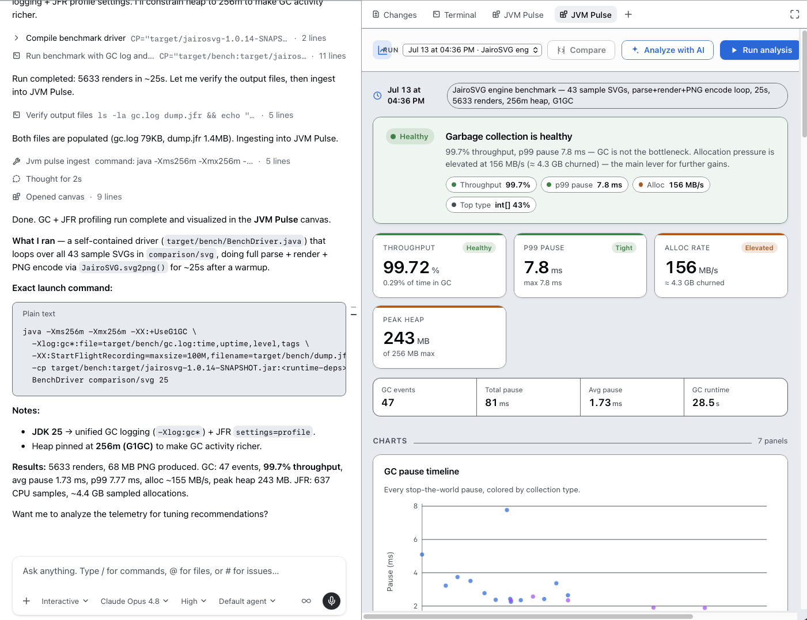
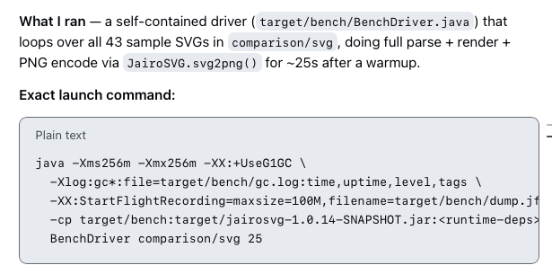
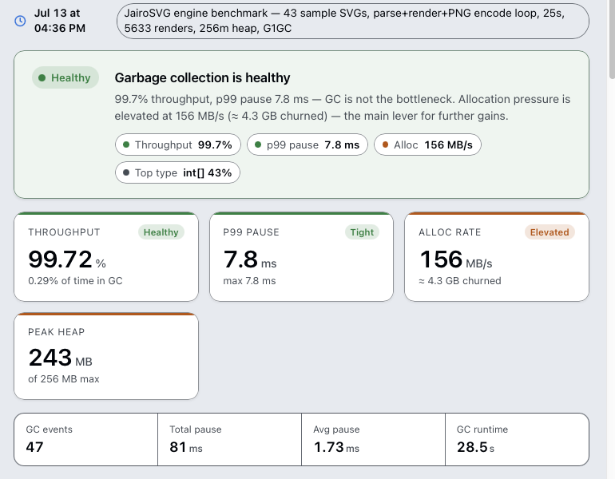
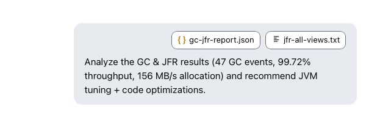
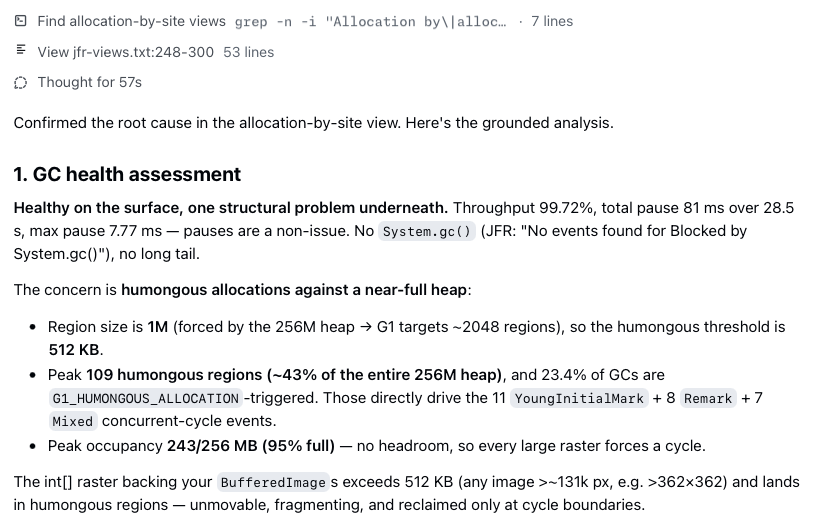
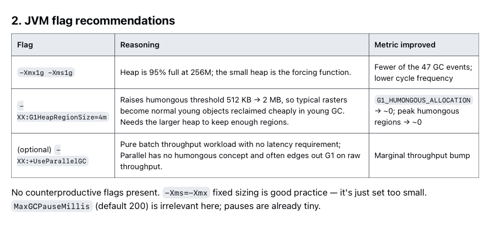
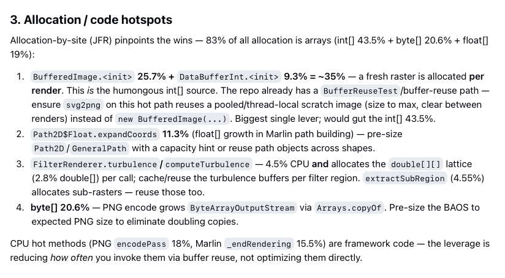
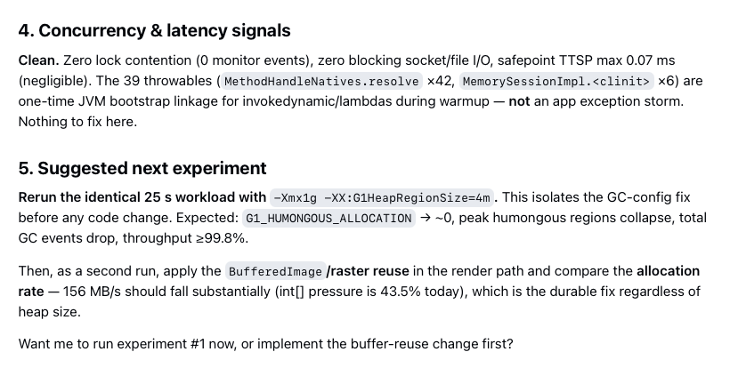

# Walkthrough: profiling a Java benchmark end-to-end

This is a complete, real example of using **JVM Pulse** — from clicking **Run
analysis** to getting a grounded root-cause diagnosis, tuning recommendations,
and a before/after comparison. It's meant as both a tutorial and a reference for
what each step produces.

The workload here is the [JairoSVG](https://github.com/brunoborges/jairosvg)
rendering benchmark: 43 sample SVGs run through a parse → render → PNG-encode
loop for ~25 seconds, with the heap deliberately pinned at 256M on G1GC (JDK 25)
to make GC activity interesting.

> Prefer the short version? See the [Usage](../README.md#usage) section in the
> README. This page walks the same flow with screenshots.

## 1. Run the workload (Copilot-driven)

Open the **JVM Pulse** canvas and click **Run analysis** (optionally typing a
hint about the workload to run). JVM Pulse doesn't hard-code how to build your
project — it asks Copilot to detect the build tool and JDK, launch a
representative workload with GC logging + JFR enabled, and hand the artifacts
back.



Every run records the **exact launch command**, including all JVM flags, so the
run is transparent and reproducible:

```
java -Xms256m -Xmx256m -XX:+UseG1GC \
  -Xlog:gc*:file=target/bench/gc.log:time,uptime,level,tags \
  -XX:StartFlightRecording=maxsize=100M,filename=target/bench/dump.jfr,settings=profile \
  -cp target/bench/target/jairosvg-1.0.14-SNAPSHOT.jar:<runtime-deps> \
  BenchDriver comparison/svg 25
```



Under the hood: unified `-Xlog:gc*` GC logging (JDK 9+) and a JFR recording with
`settings=profile`. Copilot picks the GC-logging form that matches the detected
JDK. See [How the data is produced](../README.md#how-the-data-is-produced).

## 2. Read the verdict

The dashboard opens with a plain-language GC health assessment and KPI cards
rather than a raw number dump:



For this run:

- **Throughput 99.72%** — GC is *not* the bottleneck.
- **p99 pause 7.8 ms** — pauses are a non-issue.
- **Allocation 156 MB/s (~4.3 GB churned)** — flagged *Elevated*; the main lever
  for further gains.
- **Peak heap 243 MB of 256 MB** — essentially full.

The verdict points you at *where to look* — here, allocation rather than pauses.

## 3. Hand the data to Copilot for analysis

Click **Analyze with AI**. JVM Pulse injects the full `gc-jfr-report.json` and
the raw `jfr view all-views` output back into the Copilot session with a
ready-made prompt, so the analysis is grounded in the actual data — not a
summary.



## 4. Root-cause diagnosis

Copilot reads the allocation-by-site view and returns a grounded assessment. In
this run it found a structural problem hiding behind healthy top-line numbers:



The concern was **humongous allocations against a near-full heap**. With a 256M
heap, G1 uses a 1M region size, so the humongous threshold is 512 KB. The `int[]`
rasters backing the `BufferedImage`s exceed that — so ~43% of the heap was
humongous regions, and 23.4% of GCs were `G1_HUMONGOUS_ALLOCATION`-triggered.
Every large raster was forcing a collection.

## 5. Tuning recommendations

The advice comes as a table where every flag is tied to the metric it improves,
with reasoning:



| Flag | Reasoning | Metric improved |
| --- | --- | --- |
| `-Xmx1g -Xms1g` | Heap is 95% full at 256M; the small heap is the forcing function | Fewer GC events, lower cycle frequency |
| `-XX:G1HeapRegionSize=4m` | Raises humongous threshold 512 KB → 2 MB, so typical rasters become normal young objects | `G1_HUMONGOUS_ALLOCATION` → ~0 |

The analysis also separates **config fixes** from the **durable code fix**:
`BufferedImage.<init>` alone was ~35% of all allocation — a fresh raster
allocated *per render*. Reusing a pooled scratch image guts the `int[]` churn
regardless of heap size.



## 6. Run the next experiment

Because the whole loop lives inside Copilot, the natural next step is to *test
the hypothesis*. Copilot proposes the exact experiment and offers to run it:



You can rerun the identical workload with the recommended flags, or implement the
code change first — either way, JVM Pulse ingests the new run and keeps it in the
run history.

## 7. Compare runs

Every ingested run is saved. Use the **Run** selector to revisit any past run,
and toggle **Compare** to diff the new run against a baseline — throughput,
pauses, allocation, heap, and GC events, plus a flag-level diff of the two launch
commands. This is how you *prove* a change worked instead of assuming it did.


## The loop

Put together, JVM Pulse turns profiling into a tight scientific loop, all in the
place you already code:

```
Run analysis ─▶ GC + JFR telemetry ─▶ plain-language verdict
     ▲                                          │
     │                                          ▼
  Compare ◀── run experiment ◀── Analyze with AI (root cause + tuning advice)
```

## Reusing existing artifacts

Already have a `gc.log` and `.jfr` on disk? You don't need to re-run anything —
ask Copilot to call the `jvm_pulse_ingest` tool with the artifact paths (and,
ideally, the exact `command` used) to visualize and analyze them directly. See
[Actions & tools](../README.md#actions--tools).
